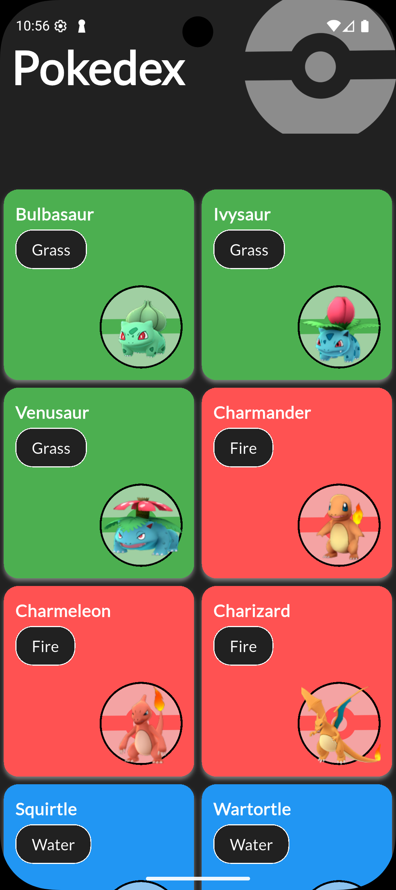
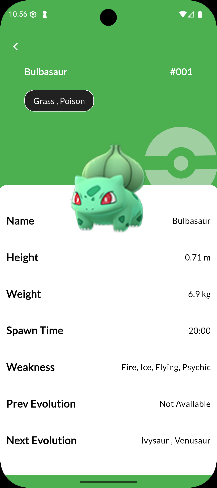
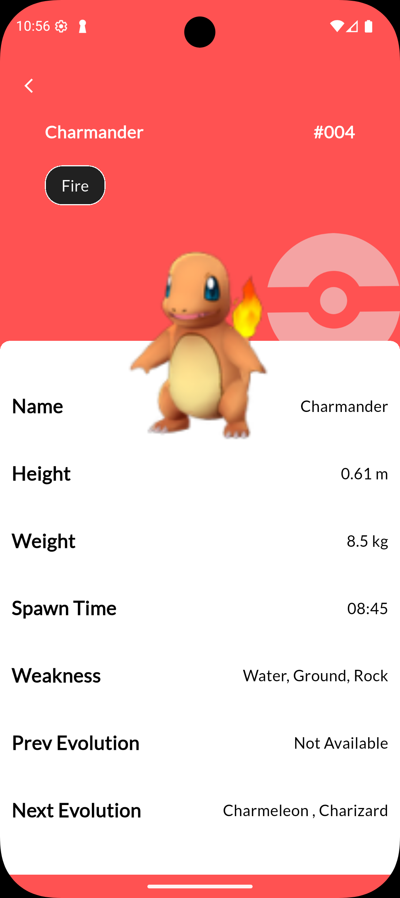
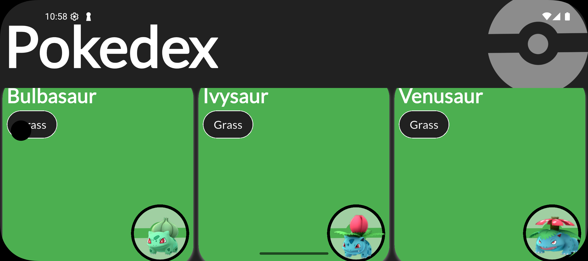
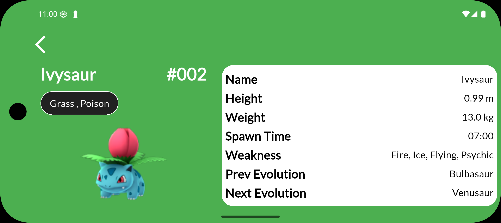
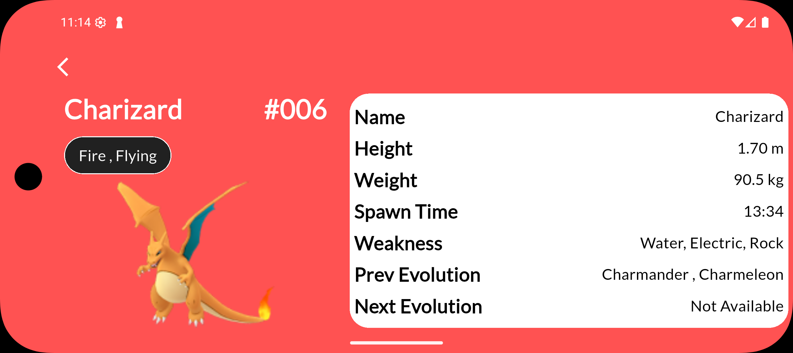

# Pokedex App <p align="right">
  <a href="README_EN.md">🇬🇧 English</a>
</p>

[](https://github.com/aliozdeemir/pokedex/actions/workflows/flutter-ci.yml) [](LICENSE)

[](https://github.com/aliozdeemir) [](https://www.linkedin.com/in/aoz-demir) [](mailto:aoz.demir@outlook.com)


Flutter ile geliştirilmiş, modern tasarım prensiplerini kullanan bir Pokémon veritabanı uygulaması.

## Proje Özellikleri

- **Modern UI/UX**: Flutter widget'ları ile kullanıcı dostu arayüz tasarımı
- **Responsive Tasarım**: flutter_screenutil paketi kullanarak tüm ekran boyutlarına uyum sağlayan tasarım
- **Hero Animasyonları**: Sayfalar arası geçişlerde akıcı deneyim sağlayan Hero animasyonları
- **REST API Entegrasyonu**: Dio paketi ile uzak API'dan veri çekme
- **Dinamik Tema**: Pokemon türüne göre otomatik renk değişimi
- **Google Fonts**: Özel yazı tipleri ile gelişmiş tipografi
- **Modüler Yapı**: Sürdürülebilir ve yeniden kullanılabilir kod mimarisi

## Teknik Detaylar

### Kullanılan Teknolojiler ve Paketler
- **Flutter**: UI framework
- **Dio**: HTTP istekleri için
- **flutter_screenutil**: Responsive tasarım için
- **google_fonts**: Özel yazı tipleri için

### Mimari Yapı
Proje, temiz kod prensipleri gözetilerek aşağıdaki yapıda organize edilmiştir:
- **constants/**: Sabit değerler ve UI yardımcıları
- **model/**: Veri modelleri ve JSON dönüşümleri
- **services/**: API servisleri
- **pages/**: Ekran sayfaları
- **widget/**: Yeniden kullanılabilir widget bileşenleri

### API Kullanımı
Proje, PokéAPI üzerinden Pokémon verilerini çeker ve kullanıcıya sunar. Veri işleme modeli sayesinde JSON verileri Dart nesnelerine dönüştürülür.

### Responsive Tasarım
ScreenUtil paketi ile farklı ekran boyutlarına uyum sağlayan bir tasarım uygulanmıştır. Bu sayede uygulama çeşitli cihazlarda tutarlı bir görünüme sahiptir.

### Hero Animasyonları
Liste sayfasından detay sayfasına geçişlerde Hero widget'ları kullanılarak akıcı animasyonlar sağlanmıştır. Bu, kullanıcı deneyimini iyileştiren önemli bir özelliktir.

## Ekran Görüntüleri
Aşağıda uygulamadan bazı ekran görüntüleri bulunmaktadır (emülatör/cihaz). Görüntüye tıklayarak tam boyutta görüntüleyebilirsiniz.

<div align="center">
	<a href="screenshots/phone1.png"></a>
	<a href="screenshots/phone2.png"></a>
	<a href="screenshots/phone3.png"></a>
	<br/>
	<a href="screenshots/phone4.png"></a>
	<a href="screenshots/phone5.png"></a>
	<a href="screenshots/phone6.png"></a>
</div>

## Kurulum

```bash
# Depoyu klonlayın
git clone https://github.com/aliozdeemir/pokedex.git

# Proje dizinine gidin
cd pokedex

# Bağımlılıkları yükleyin
flutter pub get

# Uygulamayı çalıştırın
flutter run
```

## İletişim

<p>
	<a href="https://github.com/aliozdeemir"></a>
	<a href="https://www.linkedin.com/in/aoz-demir"></a>
	<a href="mailto:aoz.demir@outlook.com"></a>
</p>
