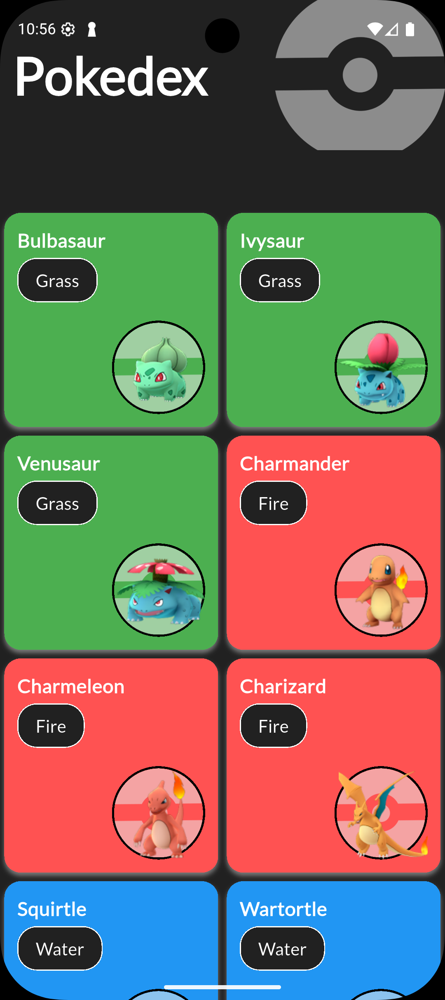
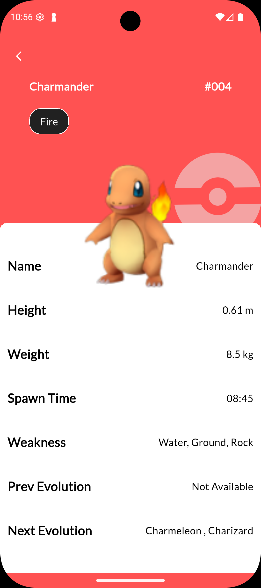

# Pokedex App
<p align="left">
  <a href="README.md">TR Türkçe</a>
</p>

[](https://github.com/aliozdeemir/pokedex/actions/workflows/flutter-ci.yml) [](LICENSE)

[](https://github.com/aliozdeemir) [](https://www.linkedin.com/in/aoz-demir) [](mailto:aoz.demir@outlook.com)

A modern and responsive Pokémon database app built with Flutter.


## Table of Contents
- [Features](#features)
- [Tech Stack](#tech-stack)
- [Screenshots](#screenshots)
- [Installation](#installation)
- [Contributing](#contributing)
- [License](#license)
- [Contact](#contact)

## Features

- Modern UI/UX with Flutter widgets
- Responsive layout using `flutter_screenutil`
- Hero animations for smooth transitions
- REST API integration with PokéAPI using `dio`
- Dynamic theming based on Pokémon type
- Modular project structure for maintainability

## Tech Stack

- Flutter
- Dio
- flutter_screenutil
- google_fonts

## Screenshots

Gallery (click to view full size):
<div align="center">
	<a href="screenshots/phone1.png"></a>
	<a href="screenshots/phone2.png"></a>
	<a href="screenshots/phone3.png"></a>
	<br/>
	<a href="screenshots/phone4.png"></a>
	<a href="screenshots/phone5.png"></a>
	<a href="screenshots/phone6.png"></a>
</div>

## Installation

Clone, get packages and run:

```bash
git clone https://github.com/aliozdeemir/pokedex.git
cd pokedex
flutter pub get
flutter run
```

Tips
- Use a common design reference for `ScreenUtilInit` (e.g. `Size(360, 800)`) or match the target device logical size.

## Contributing

Contributions are welcome — open an issue or send a pull request. See `CONTRIBUTING.md` for guidelines.

## License

This project is licensed under the MIT License — see the `LICENSE` file.

## Contact

<p>
	<a href="https://github.com/aliozdeemir"></a>
	<a href="https://www.linkedin.com/in/aoz-demir"></a>
	<a href="mailto:aoz.demir@outlook.com"></a>
</p>
